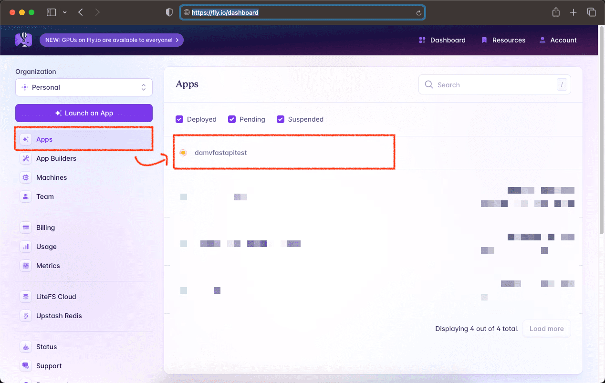
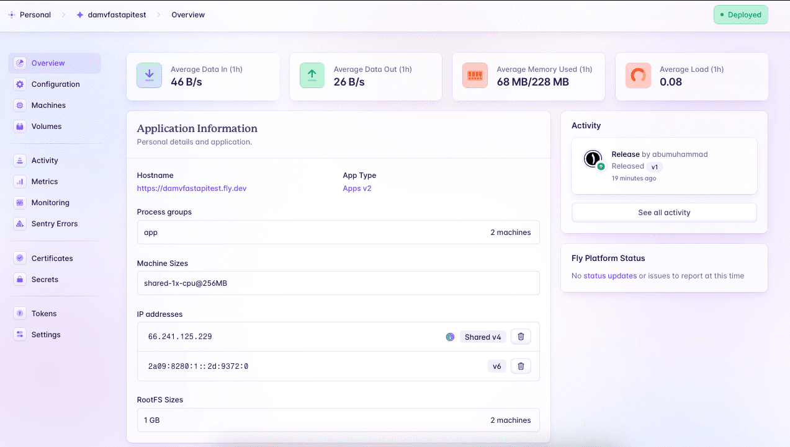
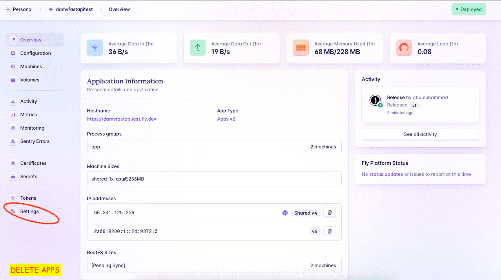

# Python fastapi fly.io deploy damvfastapitest

#### files structure :

    ❯ tree -L 2 -I 'gambar-petunjuk|README.md'

        ├── Dockerfile
        ├── fly.toml
        ├── main.py
        └── requirements.txt

        0 directories, 4 files

### &#x1FAB6; code :

- python 

        ❯ vim main.py

            from fastapi import FastAPI

            app = FastAPI()

            @app.get('/')
            async def root() -> str:
                return 'How are you doing ;-)!'

            if __name__ == "__main__":
                import uvicorn

                uvicorn.run(app, host="0.0.0.0", port=10000)

- Dockerfile

    Docker can build images automatically by reading the instructions from a Dockerfile. A Dockerfile is a text document that contains all the commands a user could call on the command line to assemble an image.

        ❯ vim Dockerfile

            FROM python:3.8

            RUN useradd -ms /bin/bash user
            USER user

            WORKDIR /home/user

            COPY requirements.txt .

            RUN pip install -r requirements.txt && rm requirements.txt

            COPY . .

            EXPOSE 10000

            ENTRYPOINT [ "python", "main.py"]

### Test application with Docker container

    ❯ docker build -t fastapi_howareyou . 

    ❯ docker run -d --name fastapi_howareyou-svc -p 10000:10000 fastapi_howareyou

&#x1F535; list :

    ❯ docker images

        REPOSITORY          TAG       IMAGE ID       CREATED          SIZE
        fastapi_howareyou   latest    5c5b70f242d6   21 seconds ago   1.05GB

    ❯ docker ps -a

        CONTAINER ID   IMAGE               COMMAND            CREATED          STATUS          PORTS                      NAMES
        8cc546a9a5ce   fastapi_howareyou   "python main.py"   44 seconds ago   Up 43 seconds   0.0.0.0:10000->10000/tcp   fastapi_howareyou-svc

#### application :

- CURL :

        curl --location 'http://localhost:10000/'

- Postman :

    

- Swagger / API documentation

    

---

#### Reset containers :

    ❯ docker rm -f $(docker ps -aq) && docker rmi -f $(docker images -q)

        8cc546a9a5ce
        Untagged: fastapi_howareyou:latest
        Deleted: sha256:5c5b70f242d6bfc0f86e99db3a94a442e3b6e0f43be1e7a87598dbc9f0fe8699
---

    

---

## Stages in deploying the application to fly.io

Reference : 

- commands flyctl agent `https://fly.io/docs/flyctl/agent/#main-content-start`

- manual pages `https://fig.io/manual/flyctl`

---

#### code :

- toml [Tom's Obvious Minimal Language]

    TOML aims to be a minimal configuration file format that's easy to read due to obvious semantics. TOML is designed to map unambiguously to a hash table. TOML should be easy to parse into data structures in a wide variety of languages.

        ❯ vim fly.toml

            app = "damvfastapitest"

            kill_signal = "SIGINT"
            kill_timeout = 5
            processes = []

            [experimental]
            allowed_public_ports = []
            auto_rollback = true

            [[services]]
            http_checks = []
            internal_port = 10000
            processes = ["app"]
            protocol = "tcp"
            script_checks = []

            [services.concurrency]
                hard_limit = 25
                soft_limit = 20
                type = "connections"

            [[services.ports]]
                force_https = true
                handlers = ["http"]
                port = 80

            [[services.ports]]
                handlers = ["tls", "http"]
                port = 443

            [[services.tcp_checks]]
                grace_period = "1s"
                interval = "15s"
                restart_limit = 0
                timeout = "2s"

### check version :

    ❯ flyctl version

        Update available 0.0.456 -> v0.2.15.
        Run "flyctl version update" to upgrade.
        flyctl v0.0.456 darwin/arm64 Commit: 43371b58 BuildDate: 2023-02-08T22:32:29Z

#### Attention! :

if you get a flyctl version that is behind the current update, it's a good idea to update it. Otherwise when deploying flyctl, you will get the following error message: `Error failed to launch VM: flyctl version too old, must be at least 0.1.20`

### &#x1F535; best step UPDATE VERSION of FLYCTL based on applying custom settings on initial fly.io installation :

discard current flyctl setup and installation

    ❯ killall flyctl

    ❯ sudo rm -rf /usr/local/bin/fly    

&#x1F527; apply the installation and setup steps as previously guided at `https://github.com/4bumuhammad/fly.io-install-on-mac-m1-beginner/blob/main/README.md`.

#### [after successfully reinstalling flyctl]

    ❯ flyctl version

        flyctl v0.2.15 darwin/arm64 Commit: 846630217aff135b32ec0d6a018cf6bdde0f1762 BuildDate: 2024-03-10T09:52:28Z

### &#x1F530; create Apps :

    ❯ flyctl apps create --name damvfastapitest

        automatically selected personal organization: abumuhammad
        New app created: damvfastapitest

check and watch for updates on the fly.io console dashboard

    

### &#x1F530; deploy Apps :

    ❯ flyctl deploy

        ==> Verifying app config
        Validating /Users/.../python-fastapi-fly.io-deploy-damvfastapitest/fly.toml
        ✓ Configuration is valid
        --> Verified app config
        ==> Building image
        Remote builder fly-builder-throbbing-shadow-8193 ready
        Remote builder fly-builder-throbbing-shadow-8193 ready
        ==> Building image with Docker
        --> docker host: 20.10.12 linux x86_64
        [+] Building 2.1s (11/11) FINISHED                                                                                                                                                                                                   
        => [internal] load build definition from Dockerfile                                                                           0.1s
        => => transferring dockerfile: 260B                                                                                           0.1s
        => [internal] load .dockerignore                                                                                              0.1s
        => => transferring context: 2B                                                                                                0.1s
        => [internal] load metadata for docker.io/library/python:3.8                                                                  1.6s
        => [1/6] FROM docker.io/library/python:3.8@sha256:12266a9bc0318a9e0131561fc98d53b75325a3c2abd62aebc8302e3beb503b05            0.0s
        => [internal] load build context                                                                                              0.3s
        => => transferring context: 283.21kB                                                                                          0.3s
        => CACHED [2/6] RUN useradd -ms /bin/bash user                                                                                0.0s
        => CACHED [3/6] WORKDIR /home/user                                                                                            0.0s
        => CACHED [4/6] COPY requirements.txt .                                                                                       0.0s
        => CACHED [5/6] RUN pip install -r requirements.txt && rm requirements.txt                                                    0.0s
        => [6/6] COPY . .                                                                                                             0.0s
        => exporting to image                                                                                                         0.0s
        => => exporting layers                                                                                                        0.0s
        => => writing image sha256:cb68045d461067dd128020795a27e28641e11067d2e4990f8e865d67d83e369d                                   0.0s
        => => naming to registry.fly.io/damvfastapitest:deployment-01HRPCJ5K760CJY1J4TACM39TY                                         0.0s
        --> Building image done
        ==> Pushing image to fly
        The push refers to repository [registry.fly.io/damvfastapitest]
        8dc4eda9fb96: Pushed 
        1b963ad31a1b: Pushed 
        abd4a0c45074: Pushed 
        5f70bf18a086: Pushed 
        4d281ae3d48f: Pushed 
        6e751b5b0bee: Pushed 
        126cdbcad241: Pushed 
        01589a17de95: Pushed 
        84f540ade319: Pushed 
        9fe4e8a1862c: Pushed 
        909275a3eaaa: Pushed 
        f3f47b3309ca: Pushed 
        1a5fc1184c48: Pushed 
        deployment-01HRPCJ5K760CJY1J4TACM39TY: digest: sha256:136a394ec3fd9dfa685a451728d4e848db6c8226f6fc2986467644c1a122ead2 size: 3050
        --> Pushing image done
        image: registry.fly.io/damvfastapitest:deployment-01HRPCJ5K760CJY1J4TACM39TY
        image size: 1.1 GB

        Watch your deployment at https://fly.io/apps/damvfastapitest/monitoring

        Provisioning ips for damvfastapitest
        Dedicated ipv6: 2a09:8280:1::2d:8b1b:0
        Shared ipv4: 66.241.125.214
        Add a dedicated ipv4 with: fly ips allocate-v4

        This deployment will:
        * create 2 "app" machines

        No machines in group app, launching a new machine
        Creating a second machine to increase service availability
        Finished launching new machines
        -------
        ✔ Machine 3287119f940285 [app] update finished: success

        -------
        Checking DNS configuration for damvfastapitest.fly.dev

        Visit your newly deployed app at https://damvfastapitest.fly.dev/

check and watch for updates on the fly.io console dashboard

    

### &#x1F530; check

    ❯ curl -X GET https://damvfastapitest.fly.dev

        "How are you doing ;-)!"%

    ❯ flyctl status

        App
        Name     = damvfastapitest                                        
        Owner    = personal                                               
        Hostname = damvfastapitest.fly.dev                                
        Image    = damvfastapitest:deployment-01HRPCJ5K760CJY1J4TACM39TY  

        Machines
        PROCESS ID              VERSION REGION  STATE   ROLE    CHECKS                  LAST UPDATED         
        app     3287119f940285  1       sin     started         1 total, 1 passing      2024-03-11T09:14:49Z
        app     6e82330f512287  1       sin     started         1 total, 1 passing      2024-03-11T09:14:26Z

    ❯ flyctl ips list

        VERSION IP                      TYPE                    REGION  CREATED AT       
        v6      2a09:8280:1::2d:8b1b:0  public (dedicated)      global  2h35m ago       
        v4      66.241.125.214          public (shared)                 Jan 1 0001 00:00

        Learn more about Fly.io public, private, shared and dedicated IP addresses in our docs: https://fly.io/docs/reference/services/#ip-addresses

    ❯ flyctl services list

        Services
        PROTOCOL        PORTS           HANDLERS        FORCE HTTPS     PROCESS GROUP   REGIONS MACHINES 
        TCP             80 => 10000     [HTTP]          True            app             sin     2       
        TCP             443 => 10000    [TLS,HTTP]      False           app             sin     2  

### &#x1F530; open :

    ❯ flyctl open

        Command "open" is deprecated, use `fly apps open` instead
        opening https://damvfastapitest.fly.dev/ ...

#### &#x1F535; postman : 

    

---

    

---

### Remove Apps : 

    

    

---